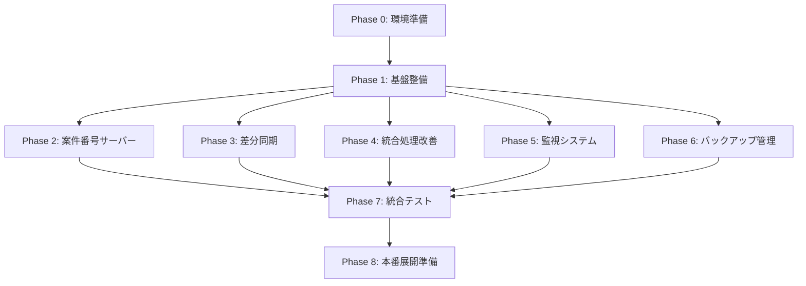

# 貿易DX V2.1 - 開発フェーズ管理計画

## 📋 目次
1. [開発方針](#開発方針)
2. [フェーズ概要](#フェーズ概要)
3. [各フェーズの詳細](#各フェーズの詳細)
4. [フェーズ間の依存関係](#フェーズ間の依存関係)
5. [リスク管理](#リスク管理)
6. [チェックリスト](#チェックリスト)

---

## 🎯 開発方針

### 基本原則
1. **段階的実装** - 一度に全機能を実装せず、段階的に進める
2. **独立性の確保** - 各フェーズが独立して動作・テスト可能
3. **後方互換性** - 既存のV2.0環境を壊さない
4. **早期テスト** - 各フェーズ完了後、即座にテスト
5. **ロールバック可能** - 問題発生時は前フェーズに戻れる

### 成功基準
- ✅ 各フェーズが独立してテスト可能
- ✅ フェーズ完了ごとに動作確認完了
- ✅ 次フェーズへの影響を最小化
- ✅ ドキュメントとコードの同期

---

## 📊 フェーズ概要

```
Phase 0: 環境準備 (1日)
   ↓
Phase 1: 基盤整備 (2日)
   ↓
Phase 2: 案件番号サーバー (3日)
   ↓
Phase 3: 差分同期機能 (3日)
   ↓
Phase 4: 統合処理改善 (3日)
   ↓
Phase 5: 監視システム (2日)
   ↓
Phase 6: バックアップ管理 (1日)
   ↓
Phase 7: 統合テスト (3日)
   ↓
Phase 8: 本番展開準備 (2日)

総期間: 20営業日（4週間）
```

---

## 📅 各フェーズの詳細

---

## Phase 0: 環境準備（1日）

### 目的
開発環境とディレクトリ構成を整備

### 作業内容

#### 1. ディレクトリ構成の作成
```bash
貿易DX/
├── master/              # マスターファイル格納
├── work/                # 個人ファイル格納
├── backup/              # バックアップ
├── logs/                # ログファイル
├── scripts/             # Pythonスクリプト
│   ├── phase1/         # Phase 1のコード
│   ├── phase2/         # Phase 2のコード
│   ├── phase3/         # Phase 3のコード
│   ├── phase4/         # Phase 4のコード
│   ├── phase5/         # Phase 5のコード
│   ├── phase6/         # Phase 6のコード
│   └── tests/          # テストコード
└── docs/                # ドキュメント
```

#### 2. 必要なツールのインストール
```bash
# Python 3.9以降の確認
python --version

# 必要ライブラリのインストール
pip install pandas openpyxl pytest --break-system-packages

# バージョン確認
pip list | grep -E "pandas|openpyxl|pytest"
```

#### 3. テンプレートファイルの準備
- [ ] 案件管理台帳_マスター.xlsm をmasterフォルダに配置
- [ ] サンプルデータを10件程度入力

#### 4. Git管理の開始（推奨）
```bash
cd 貿易DX/scripts
git init
git add .
git commit -m "Phase 0: 初期セットアップ"
```

### 成果物
- [x] ディレクトリ構成
- [x] 開発環境
- [x] テンプレートファイル

### 完了条件
- [ ] すべてのフォルダが作成済み
- [ ] Python環境が正常動作
- [ ] サンプルファイルが配置済み

---

## Phase 1: 基盤整備（2日）

### 目的
全フェーズで共通利用する基盤コードを実装

### 作業内容

#### Day 1: 設定管理とロギング

**ファイル: `scripts/phase1/config.json`**
```json
{
  "version": "2.1",
  "paths": {
    "master_dir": "./master",
    "work_dir": "./work",
    "backup_dir": "./backup",
    "log_dir": "./logs",
    "scripts_dir": "./scripts"
  },
  "users": [
    {"name": "山田", "email": "yamada@example.com"},
    {"name": "鈴木", "email": "suzuki@example.com"}
  ]
}
```

**ファイル: `scripts/phase1/common.py`**
- [ ] 設定ファイル読み込み関数
- [ ] ロガー初期化関数
- [ ] ファイルパス生成関数
- [ ] エラーハンドリング用デコレータ

```python
#!/usr/bin/env python3
# -*- coding: utf-8 -*-
"""
共通関数モジュール (common.py)
Phase 1で実装
"""

import json
import logging
from pathlib import Path
from datetime import datetime
from functools import wraps

# 実装する関数:
# - load_config()
# - setup_logger()
# - get_file_path()
# - error_handler() デコレータ
```

#### Day 2: ファイルI/O共通処理

**ファイル: `scripts/phase1/file_handler.py`**
- [ ] Excelファイル読み込み
- [ ] Excelファイル書き込み
- [ ] ファイルロック検知
- [ ] 安全なファイル操作

```python
#!/usr/bin/env python3
# -*- coding: utf-8 -*-
"""
ファイル操作モジュール (file_handler.py)
Phase 1で実装
"""

import pandas as pd
from pathlib import Path

# 実装する関数:
# - read_excel_safe()
# - write_excel_safe()
# - check_file_locked()
# - create_backup()
```

### テスト

**ファイル: `scripts/tests/test_phase1.py`**
```python
import pytest
from phase1.common import load_config, setup_logger
from phase1.file_handler import check_file_locked

def test_load_config():
    """設定ファイル読み込みテスト"""
    config = load_config("phase1/config.json")
    assert config['version'] == '2.1'
    assert 'paths' in config

def test_file_lock_detection():
    """ファイルロック検知テスト"""
    # テストケース実装
    pass
```

### 成果物
- [x] config.json
- [x] common.py
- [x] file_handler.py
- [x] test_phase1.py

### 完了条件
- [ ] 全テストがパス
- [ ] 設定ファイルが正常に読み込める
- [ ] ロガーが正常に動作
- [ ] ファイルI/Oが正常に動作

### Git管理
```bash
git add scripts/phase1/
git commit -m "Phase 1: 基盤整備完了"
git tag phase1-complete
```

---

## Phase 2: 案件番号サーバー（3日）

### 目的
中央集権型の案件番号採番サーバーを実装

### 依存関係
- Phase 1の完了が必須

### 作業内容

#### Day 1: サーバー本体の実装

**ファイル: `scripts/phase2/case_number_server.py`**

実装する機能:
- [ ] HTTPサーバーの起動
- [ ] `/generate` エンドポイント（案件番号生成）
- [ ] `/status` エンドポイント（状態確認）
- [ ] `/health` エンドポイント（ヘルスチェック）
- [ ] 連番データの永続化（JSON）

```python
#!/usr/bin/env python3
# -*- coding: utf-8 -*-
"""
案件番号採番サーバー (case_number_server.py)
Phase 2で実装
"""

from http.server import HTTPServer, BaseHTTPRequestHandler
import json
import threading

class CaseNumberServer:
    """案件番号管理クラス"""
    
    def __init__(self, data_file: str = "./case_numbers.json"):
        # 実装
        pass
    
    def generate_case_number(self, case_type: str, user: str) -> dict:
        # 実装
        pass

# 以下、詳細設計書のコードを実装
```

#### Day 2: VBAクライアントの実装

**ファイル: `VBA/GenerateCaseNumber.bas`**

実装する機能:
- [ ] サーバーへのHTTPリクエスト
- [ ] レスポンスのパース
- [ ] エラーハンドリング
- [ ] ローカル採番へのフォールバック

```vba
Function GenerateCaseNumberFromServer(caseType As String) As String
    ' Phase 2で実装
    ' サーバーから案件番号を取得
    ' エラー時はローカル採番
End Function
```

#### Day 3: テストとデバッグ

**ファイル: `scripts/tests/test_phase2.py`**
```python
import pytest
import requests

def test_server_health():
    """サーバー起動テスト"""
    response = requests.get("http://localhost:8080/health")
    assert response.status_code == 200

def test_generate_case_number():
    """案件番号生成テスト"""
    response = requests.get(
        "http://localhost:8080/generate?type=EX&user=test"
    )
    assert response.status_code == 200
    data = response.json()
    assert data['success'] == True
    assert 'case_number' in data

def test_concurrent_requests():
    """同時リクエストテスト"""
    # 複数スレッドから同時にリクエスト
    # 重複がないことを確認
    pass
```

**手動テスト:**
- [ ] サーバー起動確認
- [ ] ブラウザで http://localhost:8080/health にアクセス
- [ ] VBAからの案件番号生成テスト
- [ ] 10件連続生成して重複がないことを確認

### 成果物
- [x] case_number_server.py
- [x] case_numbers.json（データファイル）
- [x] GenerateCaseNumber.bas（VBA）
- [x] test_phase2.py
- [x] start_server.bat（起動スクリプト）

### 完了条件
- [ ] サーバーが正常に起動
- [ ] 案件番号が正常に生成される
- [ ] VBAから呼び出せる
- [ ] 同時アクセスでも重複しない
- [ ] 全テストがパス

### Git管理
```bash
git add scripts/phase2/
git commit -m "Phase 2: 案件番号サーバー完了"
git tag phase2-complete
```

---

## Phase 3: 差分同期機能（3日）

### 目的
30分ごとの軽量な差分同期を実装

### 依存関係
- Phase 1の完了が必須
- Phase 2は独立（並行開発可能）

### 作業内容

#### Day 1: 差分検知ロジック

**ファイル: `scripts/phase3/incremental_sync.py`**

実装する機能（Part 1）:
- [ ] 個人ファイルから未同期データを抽出
- [ ] 同期済みフラグ列の追加
- [ ] 最終同期日時の記録

```python
#!/usr/bin/env python3
# -*- coding: utf-8 -*-
"""
差分同期スクリプト (incremental_sync.py)
Phase 3で実装
"""

import sys
sys.path.append('../phase1')
from common import load_config, setup_logger
from file_handler import read_excel_safe, write_excel_safe

class IncrementalSync:
    """差分同期クラス"""
    
    def __init__(self, config_path: str):
        # 実装
        pass
    
    def get_unsynced_data(self, user_name: str) -> pd.DataFrame:
        """未同期データを取得"""
        # 実装
        pass
```

#### Day 2: マスター更新ロジック

実装する機能（Part 2）:
- [ ] マスターファイルの読み込み
- [ ] 新規案件の追加
- [ ] 既存案件の更新
- [ ] 個人ファイルの同期済みフラグ更新

```python
def update_master(self, unsynced_data_list: list) -> int:
    """マスターファイルを更新"""
    # 実装
    pass

def mark_as_synced(self, user_name: str, case_numbers: list):
    """同期済みフラグを更新"""
    # 実装
    pass
```

#### Day 3: 統合とテスト

実装する機能（Part 3）:
- [ ] メイン処理の実装
- [ ] エラーハンドリング
- [ ] ログ出力

**ファイル: `scripts/tests/test_phase3.py`**
```python
import pytest
from phase3.incremental_sync import IncrementalSync

def test_get_unsynced_data():
    """未同期データ取得テスト"""
    # テストケース実装
    pass

def test_update_master():
    """マスター更新テスト"""
    # テストケース実装
    pass

def test_full_sync_flow():
    """全体フローテスト"""
    # 1. サンプルデータを個人ファイルに追加
    # 2. 差分同期を実行
    # 3. マスターに反映されているか確認
    # 4. 同期済みフラグが立っているか確認
    pass
```

**手動テスト:**
- [ ] 個人ファイルに新規データを追加
- [ ] スクリプトを実行
- [ ] マスターファイルを確認
- [ ] 同期済みフラグを確認
- [ ] 2回目の実行で重複しないことを確認

### 成果物
- [x] incremental_sync.py
- [x] test_phase3.py
- [x] 実行用バッチファイル

### 完了条件
- [ ] 未同期データが正しく抽出される
- [ ] マスターが正しく更新される
- [ ] 同期済みフラグが正しく更新される
- [ ] 全テストがパス
- [ ] 処理時間が5秒以内

### Git管理
```bash
git add scripts/phase3/
git commit -m "Phase 3: 差分同期機能完了"
git tag phase3-complete
```

---

## Phase 4: 統合処理改善（3日）

### 目的
競合解決とリトライ機構を実装

### 依存関係
- Phase 1の完了が必須
- Phase 3と独立（並行開発可能）

### 作業内容

#### Day 1: 項目単位の競合解決

**ファイル: `scripts/phase4/integrate_data.py`**

実装する機能（Part 1）:
- [ ] 項目単位のマージロジック
- [ ] 最新タイムスタンプの判定
- [ ] 競合ログの出力

```python
#!/usr/bin/env python3
# -*- coding: utf-8 -*-
"""
統合処理スクリプト（改良版）(integrate_data.py)
Phase 4で実装
"""

import sys
sys.path.append('../phase1')
from common import load_config, setup_logger
from file_handler import read_excel_safe, write_excel_safe

def merge_with_field_level_resolution(master_df, user_dfs):
    """
    項目単位でマージ
    Phase 4で実装
    """
    # 実装
    pass
```

#### Day 2: ファイルロック検知とリトライ

実装する機能（Part 2）:
- [ ] ファイルロック検知
- [ ] リトライ機構（最大3回）
- [ ] アラートメール送信

```python
def check_file_locked(file_path: Path) -> bool:
    """ファイルロック検知"""
    # 実装
    pass

def integrate_with_retry(max_retry: int = 3, retry_interval: int = 60):
    """リトライ機能付き統合"""
    # 実装
    pass

def send_alert_email(subject: str, message: str):
    """アラートメール送信"""
    # 実装
    pass
```

#### Day 3: 統合とテスト

**ファイル: `scripts/tests/test_phase4.py`**
```python
import pytest
from phase4.integrate_data import merge_with_field_level_resolution

def test_field_level_merge():
    """項目単位マージテスト"""
    # 同じ案件番号で異なる項目を更新
    # 両方が反映されることを確認
    pass

def test_conflict_resolution():
    """競合解決テスト"""
    # 同じ項目への同時更新
    # 最新のものが採用されることを確認
    pass

def test_retry_mechanism():
    """リトライ機構テスト"""
    # ファイルをロックした状態で実行
    # リトライが動作することを確認
    pass
```

**手動テスト:**
- [ ] 山田さんが数量を更新（15:00）
- [ ] 鈴木さんが単価を更新（15:30）
- [ ] 統合処理を実行
- [ ] 両方の更新が反映されているか確認
- [ ] 競合ログを確認

### 成果物
- [x] integrate_data.py（改良版）
- [x] test_phase4.py
- [x] 競合ログのサンプル

### 完了条件
- [ ] 項目単位のマージが動作
- [ ] 競合が適切に解決される
- [ ] リトライが正常に動作
- [ ] 競合ログが出力される
- [ ] 全テストがパス

### Git管理
```bash
git add scripts/phase4/
git commit -m "Phase 4: 統合処理改善完了"
git tag phase4-complete
```

---

## Phase 5: 監視システム（2日）

### 目的
死活監視とヘルスチェックを実装

### 依存関係
- Phase 1の完了が必須
- Phase 2-4の完了が望ましい（監視対象）

### 作業内容

#### Day 1: ヘルスチェック機能

**ファイル: `scripts/phase5/healthcheck.py`**

実装する機能:
- [ ] ログファイルの解析
- [ ] スクリプトの実行確認
- [ ] ハートビートの確認
- [ ] エラー検出

```python
#!/usr/bin/env python3
# -*- coding: utf-8 -*-
"""
死活監視スクリプト (healthcheck.py)
Phase 5で実装
"""

import sys
sys.path.append('../phase1')
from common import load_config, setup_logger

class HealthChecker:
    """ヘルスチェッククラス"""
    
    def check_script_execution(self, script_name: str) -> dict:
        """スクリプトの実行状況をチェック"""
        # 実装
        pass
    
    def check_heartbeat(self) -> dict:
        """ハートビートをチェック"""
        # 実装
        pass
```

#### Day 2: アラート機能とテスト

実装する機能:
- [ ] メール送信機能
- [ ] アラート条件の判定
- [ ] レポート生成

**ファイル: `scripts/tests/test_phase5.py`**
```python
import pytest
from phase5.healthcheck import HealthChecker

def test_log_analysis():
    """ログ解析テスト"""
    # 正常ログと異常ログをテスト
    pass

def test_alert_trigger():
    """アラート発動テスト"""
    # エラー条件でアラートが発動するか
    pass
```

**手動テスト:**
- [ ] 正常なログファイルでテスト
- [ ] エラーを含むログファイルでテスト
- [ ] メール送信のテスト（テストモード）

### 成果物
- [x] healthcheck.py
- [x] test_phase5.py
- [x] メールテンプレート

### 完了条件
- [ ] ログ解析が正常に動作
- [ ] エラー検出が正常に動作
- [ ] アラートメールが送信される
- [ ] 全テストがパス

### Git管理
```bash
git add scripts/phase5/
git commit -m "Phase 5: 監視システム完了"
git tag phase5-complete
```

---

## Phase 6: バックアップ管理（1日）

### 目的
自動バックアップと世代管理を実装

### 依存関係
- Phase 1の完了が必須

### 作業内容

**ファイル: `scripts/phase6/backup_manager.py`**

実装する機能:
- [ ] バックアップ作成
- [ ] 古いバックアップの削除（30日保持）
- [ ] バックアップ一覧の取得
- [ ] 復元機能

```python
#!/usr/bin/env python3
# -*- coding: utf-8 -*-
"""
バックアップ管理スクリプト (backup_manager.py)
Phase 6で実装
"""

import sys
sys.path.append('../phase1')
from common import load_config, setup_logger

class BackupManager:
    """バックアップ管理クラス"""
    
    def create_backup(self) -> Path:
        """バックアップを作成"""
        # 実装
        pass
    
    def cleanup_old_backups(self):
        """古いバックアップを削除"""
        # 実装
        pass
    
    def restore_from_backup(self, backup_file: Path) -> bool:
        """バックアップから復元"""
        # 実装
        pass
```

**ファイル: `scripts/tests/test_phase6.py`**
```python
import pytest
from phase6.backup_manager import BackupManager

def test_create_backup():
    """バックアップ作成テスト"""
    pass

def test_cleanup():
    """クリーンアップテスト"""
    # 31日前のバックアップが削除されるか
    pass

def test_restore():
    """復元テスト"""
    pass
```

### 成果物
- [x] backup_manager.py
- [x] test_phase6.py

### 完了条件
- [ ] バックアップが作成される
- [ ] 古いバックアップが削除される
- [ ] 復元が正常に動作
- [ ] 全テストがパス

### Git管理
```bash
git add scripts/phase6/
git commit -m "Phase 6: バックアップ管理完了"
git tag phase6-complete
```

---

## Phase 7: 統合テスト（3日）

### 目的
全機能を統合してエンドツーエンドでテスト

### 依存関係
- Phase 1-6の全完了が必須

### 作業内容

#### Day 1: 統合スクリプトの作成

**ファイル: `scripts/deploy/deploy_all.py`**
- [ ] 全スクリプトを統合配置
- [ ] config.jsonの最終版作成
- [ ] タスクスケジューラ用バッチファイル作成

#### Day 2: エンドツーエンドテスト

**テストシナリオ:**

1. **シナリオ1: 通常運用**
   - [ ] 8:30 配布処理
   - [ ] 9:00 ユーザーA: 新規案件登録
   - [ ] 10:00 30分同期
   - [ ] 11:00 ユーザーB: 別案件登録
   - [ ] 17:30 統合処理
   - [ ] 結果確認

2. **シナリオ2: 競合発生**
   - [ ] ユーザーA: 案件001の数量を更新
   - [ ] ユーザーB: 案件001の単価を更新
   - [ ] 統合処理
   - [ ] 両方が反映されているか確認

3. **シナリオ3: エラーリカバリー**
   - [ ] ファイルロック状態で統合
   - [ ] リトライが動作するか確認
   - [ ] アラートメールを確認

4. **シナリオ4: 案件番号生成**
   - [ ] サーバー経由で10件生成
   - [ ] 重複がないか確認
   - [ ] サーバー停止時のフォールバック確認

#### Day 3: 性能テストと最終調整

**性能テスト:**
- [ ] 100件のデータで処理時間測定
- [ ] 1000件のデータで処理時間測定
- [ ] 10ユーザーで同時アクセステスト

**最終調整:**
- [ ] ログメッセージの調整
- [ ] エラーメッセージの改善
- [ ] ドキュメントの更新

### 成果物
- [x] deploy_all.py
- [x] 統合テスト結果レポート
- [x] 性能テスト結果レポート
- [x] 既知の問題リスト

### 完了条件
- [ ] 全シナリオが成功
- [ ] 性能基準を満たす（100件: 10秒以内）
- [ ] 既知の問題が文書化されている

### Git管理
```bash
git add scripts/deploy/
git commit -m "Phase 7: 統合テスト完了"
git tag phase7-complete
```

---

## Phase 8: 本番展開準備（2日）

### 目的
本番環境への展開準備を完了

### 依存関係
- Phase 7の完了が必須

### 作業内容

#### Day 1: 本番環境設定

**作成するもの:**
- [ ] 本番用config.json
- [ ] タスクスケジューラ登録用バッチ
- [ ] サービス起動用スクリプト
- [ ] 運用手順書

**ファイル: `scripts/deploy/setup_production.bat`**
```batch
@echo off
REM 本番環境セットアップスクリプト
echo 貿易DX V2.1 セットアップ開始...

REM ディレクトリ確認
if not exist "Z:\共有\貿易DX\master" mkdir "Z:\共有\貿易DX\master"
if not exist "Z:\共有\貿易DX\work" mkdir "Z:\共有\貿易DX\work"
if not exist "Z:\共有\貿易DX\backup" mkdir "Z:\共有\貿易DX\backup"
if not exist "Z:\共有\貿易DX\logs" mkdir "Z:\共有\貿易DX\logs"

REM スクリプトのコピー
xcopy /Y scripts\*.py "Z:\共有\貿易DX\scripts\"
xcopy /Y scripts\config.json "Z:\共有\貿易DX\scripts\"

echo セットアップ完了
pause
```

**ファイル: `docs/運用手順書_v2.1.md`**
- [ ] セットアップ手順
- [ ] タスクスケジューラ登録手順
- [ ] トラブルシューティング
- [ ] ロールバック手順

#### Day 2: ユーザー教育資料

**作成するもの:**
- [ ] ユーザーマニュアル（簡易版）
- [ ] よくある質問（FAQ）
- [ ] デモ動画（録画）
- [ ] チェックリスト

### 成果物
- [x] setup_production.bat
- [x] 本番用config.json
- [x] 運用手順書
- [x] ユーザーマニュアル
- [x] FAQ
- [x] デモ動画

### 完了条件
- [ ] 本番環境設定が完了
- [ ] 運用手順が文書化
- [ ] ユーザー教育資料が完成
- [ ] ロールバック手順が確立

### Git管理
```bash
git add scripts/deploy/ docs/
git commit -m "Phase 8: 本番展開準備完了"
git tag v2.1-release-candidate
```

---

## 📊 フェーズ間の依存関係



### 並行開発の可能性

**Phase 2, 3, 4 は並行開発可能:**
- Phase 2（案件番号サーバー）
- Phase 3（差分同期）
- Phase 4（統合処理改善）

→ 開発者が複数いる場合、3週間に短縮可能

---

## ⚠️ リスク管理

### リスク一覧

| リスク | 発生確率 | 影響度 | 対策 |
|--------|---------|--------|------|
| Phase 1の遅延 | 中 | 高 | 全体に影響大、優先度最高 |
| テストの不足 | 高 | 高 | 各フェーズで十分なテスト時間確保 |
| 既存システムへの影響 | 低 | 最高 | 常にロールバック可能に |
| 性能問題の発生 | 中 | 中 | Phase 7で性能テスト実施 |
| ユーザーの混乱 | 中 | 中 | Phase 8で十分な教育資料 |

### リスク対応

1. **Phase 1の遅延対策**
   - バッファを1日確保
   - 最小限の機能に絞る

2. **テスト不足対策**
   - 自動テストを必須化
   - コードレビューの実施

3. **既存システムへの影響対策**
   - Git tagによるバージョン管理
   - 各フェーズでロールバック可能に

---

## ✅ 全体チェックリスト

### Phase 0: 環境準備
- [ ] ディレクトリ構成の作成
- [ ] Python環境の確認
- [ ] 必要ライブラリのインストール
- [ ] サンプルファイルの準備

### Phase 1: 基盤整備
- [ ] config.json作成
- [ ] common.py実装
- [ ] file_handler.py実装
- [ ] 単体テスト実施
- [ ] Git commit

### Phase 2: 案件番号サーバー
- [ ] case_number_server.py実装
- [ ] VBAクライアント実装
- [ ] サーバー起動確認
- [ ] 統合テスト実施
- [ ] Git commit

### Phase 3: 差分同期
- [ ] incremental_sync.py実装
- [ ] 差分検知ロジック確認
- [ ] マスター更新確認
- [ ] 統合テスト実施
- [ ] Git commit

### Phase 4: 統合処理改善
- [ ] integrate_data.py改良
- [ ] 競合解決ロジック確認
- [ ] リトライ機構確認
- [ ] 統合テスト実施
- [ ] Git commit

### Phase 5: 監視システム
- [ ] healthcheck.py実装
- [ ] ログ解析確認
- [ ] アラート機能確認
- [ ] 統合テスト実施
- [ ] Git commit

### Phase 6: バックアップ管理
- [ ] backup_manager.py実装
- [ ] バックアップ作成確認
- [ ] クリーンアップ確認
- [ ] 復元機能確認
- [ ] Git commit

### Phase 7: 統合テスト
- [ ] E2Eテスト全シナリオ実施
- [ ] 性能テスト実施
- [ ] 問題点の文書化
- [ ] Git commit

### Phase 8: 本番展開準備
- [ ] 本番環境設定
- [ ] 運用手順書作成
- [ ] ユーザーマニュアル作成
- [ ] デモ動画作成
- [ ] Git tag（v2.1-release-candidate）

---

## 📝 まとめ

### 開発期間
- **最短**: 15営業日（3週間）※並行開発の場合
- **標準**: 20営業日（4週間）
- **余裕**: 25営業日（5週間）※バッファ含む

### 推奨進め方

1. **Week 1**: Phase 0-1（基盤固め）
2. **Week 2**: Phase 2-3（並行開発）
3. **Week 3**: Phase 4-6（並行開発）
4. **Week 4**: Phase 7-8（統合・展開）

### 成功のポイント

✅ **各フェーズで必ずテスト**  
✅ **Gitでバージョン管理**  
✅ **問題は即座に記録**  
✅ **ドキュメントも同時更新**  
✅ **ロールバック手順を確保**

---

**さあ、開発を始めましょう！**  
**まずはPhase 0から。一歩ずつ確実に進めていきましょう。**

